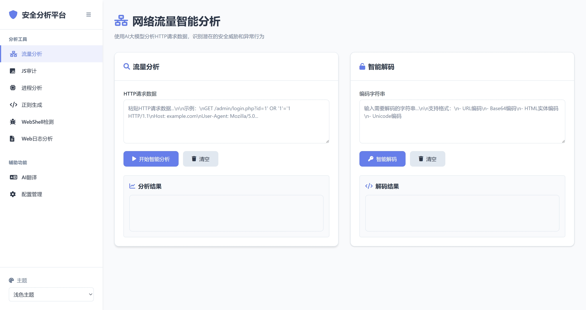

# 基于Flask-DeepSeekSelfTool项目进行重构的flask安全分析平台

- 根据[FoLaJJ/Flask-DeepSeekSelfTool: flask重构的deepseek安全分析平台，原版本位于https://github.com/ChinaRan0/DeepSeekSelfTool](https://github.com/FoLaJJ/Flask-DeepSeekSelfTool?tab=readme-ov-file)老哥进行修改的系统。未来计划新增主机基线功能与主机日志分析功能。并且将会进行再次重构。


## 具体功能
这是一个基于Flask的安全分析平台，提供多种安全分析功能，包括流量分析、JS审计、进程分析等。

具体功能详细查看知攻善防实验室的公众号

tips：
- 线上 api 模型推荐 DeepSeekV3 （不要使用 R1 推理模型，会有多余的输出且非常慢。）
- 且勿提交过长token的文本或者过长的日志。
- 正在开发的功能：
  - 主机日志分析
- 目前实现的功能有：
  - 流量分析
  - JS审计
  - 进程分析
  - 正则生成
  - WebShell检测
  - Web日志分析
## 🚀 快速开始

### 部署方式

### 1. 克隆项目
```bash
git clone https://github.com/jinghunsanzu/LMAP.git
cd LMAP
```

### 2. 安装依赖
```bash
pip install -r requirements.txt
```

### 3. 配置API
编辑 `app/config/config.ini` 文件，配置你的API信息：

```ini
[api]
type = deepseek  # 或 openrouter, ollama

[deepseek]
api_url = https://api.deepseek.com/v1/chat/completions
api_key = your_api_key_here
model = deepseek-chat
```

### 4. 运行应用
```bash
python app.py
```

访问 `http://localhost:5000` 开始使用。

## 重构页面


解码功能


webshell检测


流量分析功能



进程分析


web日志分析


正则表达式生成器


## 版本修改
- 2025.6.17 重构项目
- 2025.6.18 重构整个HTML界面
- 2025.6.22 增加web日志分析功能。并且可对话

## 许可证

MIT License
